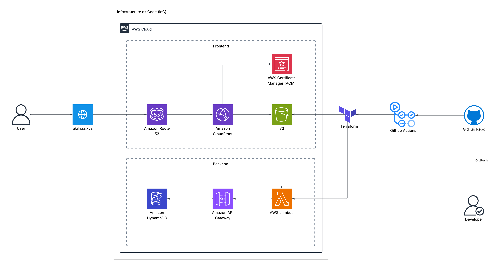

# 🌩️ Cloud Resume Challenge – Akil Riaz

This project is a full-stack cloud-based resume site built as part of the [Cloud Resume Challenge](https://cloudresumechallenge.dev/). It features a responsive static website, a live visitor counter, serverless backend, and a fully automated Infrastructure as Code (IaC) deployment using AWS services and GitHub Actions.

---

## 🚀 Features

- 🌐 **Frontend** built with HTML, CSS, and JavaScript, hosted on AWS S3.
- 📊 **Visitor Counter** implemented using AWS Lambda, API Gateway, and DynamoDB.
- 🔐 Configured **CORS**, IAM roles, and policies to ensure secure API access.
- 🔁 Fully automated **CI/CD pipelines** using GitHub Actions and YAML workflows.
- ☁️ Entire infrastructure provisioned using **Terraform** (Infrastructure as Code).
- 📂 Includes **both** manually deployed and Terraform-managed versions of the website.

---

## 📁 Project Structure

```
.
├── backend/           # Lambda function (visitor counter)
├── frontend/          # Manually deployed static site (non-Terraform)
├── infra/             # Infrastructure as Code (Terraform-managed website)
├── .github/           # GitHub Actions workflows for CI/CD
├── README.md          # Project documentation
└── .gitignore
```

---

## 🧠 Additional Context

- The project contains **two deployment approaches**:
  - `frontend/` & `backend/` – Manually deployed website hosted on S3, with "Visitor Counter" lambda function.
  - `infra/` – Terraform code to provision and automate a full replica using IaC.
- Any updates to frontend or backend infrastructure automatically trigger **CI/CD pipelines** using GitHub Actions.
- Only the **changed files** are updated on deployment to ensure efficiency.

---

## 🛠️ Tools & Technologies

- **Frontend**: HTML, CSS, JavaScript
- **Backend**: Python (with `boto3`), AWS Lambda, API Gateway, DynamoDB
- **Infrastructure**: Terraform, S3, CloudFront, Route 53, IAM
- **Automation**: GitHub, GitHub Actions, YAML, Bash
- **DevOps Concepts**: Infrastructure as Code (IaC), CI/CD, REST API, CORS

---

## 📷 Architecture Diagram



---

## 📈 Deployment Workflow

1. **Frontend Code Push** → Triggers GitHub Actions → Deploy to S3 → Invalidate CloudFront Cache
2. **Terraform Code Push** → Triggers GitHub Actions → Plan & Apply Terraform Changes
3. **Visitor Counter** → Lambda + API Gateway handle API requests and update DynamoDB
4. **Routing & Security** → CloudFront handles distribution + Route 53 DNS + IAM permissions

---

