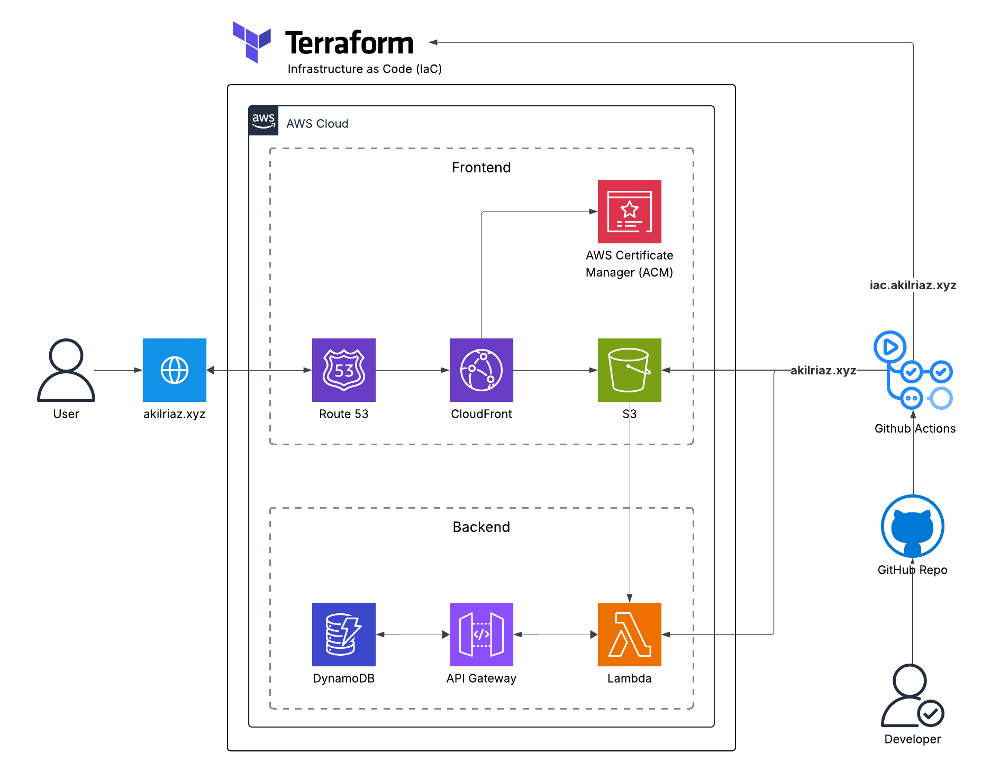

# 🌐 Cloud Resume Challenge – Infrastructure as Code (IaC)

This project is a full-stack implementation of the Cloud Resume Challenge, built using **Infrastructure as Code (IaC)** with **Terraform** and fully hosted on **AWS**. It features automated deployments for both frontend and backend via **GitHub Actions**.

---

## 🚀 Tech Stack

- **Frontend:** HTML, CSS, JavaScript  
- **Backend:** AWS Lambda, API Gateway, Python (Boto3), DynamoDB  
- **DevOps:** Terraform, GitHub Actions, Route 53, CloudFront, S3, IAM  
- **CI/CD:** YAML-based GitHub workflows with bash scripting  

---

## ⚙️ Features

- **Visitor Counter Backend**  
  Built with AWS Lambda, API Gateway, and DynamoDB. REST API integration and CORS configuration are enabled, with secure access via IAM roles and policies.

- **Backend Logic**  
  Written in Python using the Boto3 library to perform `GetItem` and `UpdateItem` operations on DynamoDB.

- **Frontend Hosting**  
  Static website hosted on a private S3 bucket and delivered via CloudFront. Uses custom domain (`iac.akilriaz.xyz`) with HTTPS (ACM). CORS and CloudFront OAC configured.

- **Automated Deployments**  
  GitHub Actions workflows detect changes to frontend or Terraform files and apply updates only where necessary, ensuring efficient infrastructure changes and version control.

---

## 🧱 Project Structure

```
infra/
├── backend/
│   └── lambda_function.py
├── frontend/
│   ├── index.html
│   ├── script.js
│   └── style.css
├── .github/
│   └── workflows/
│       └── deploy.yml
├── main.tf
└── ...
```

---

## 📌 Architecture Diagram



---

## 🔐 Security Highlights

- IAM roles with fine-grained permissions for Lambda and DynamoDB  
- CloudFront OAC ensures private access to S3  
- CORS enabled for API Gateway to support frontend interactions  
- ACM for SSL/TLS certificate on custom subdomain  

---

## 👨‍💻 Author

**Akil Riaz**  
Master of Data Science – Monash University  
🌐 [akilriaz.xyz](https://akilriaz.xyz)
